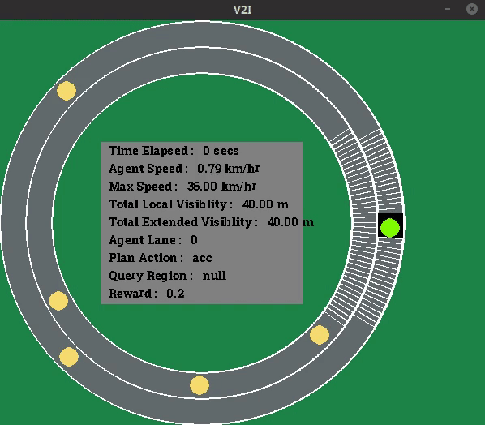

# V2I

V2I is an open-source simulator for autonomous driving research developed at Cyber-Physical Systems Lab IIIT-Delhi. It has been developed to address the need of a simulator which can simulate Vehicle-To-Infrastructure communication. The simulator is designed primarily to learn driving and querying policies using Reinforcement Learning.

<p align="center">
  
</p>

## Features

The simulator is under heavy development, new features are being added everyday. For now, the checked box represents the implemented features and rest will be implemented soon.

- [x] Occupancy Grids
- [x] Velocity Grids
- [x] Multi Lane
- [x] Driving Model for Non-Autonomous Vehicles - Intelligent Driver Model
- [ ] Multi Agent

## Installation

We recommend you to use virtual environment like conda for installation. You can get the mini version of conda from [here](https://docs.conda.io/en/latest/miniconda.html). We will use this MiniConda as our base python installation and will do the required installation on top of that. To install the dependencies, run the following commands inside the conda environment

```
conda create -n v2i python=3.6
# Activate the environment
conda activate v2i

# Install all required dependencies
pip install -r requirements.txt

```